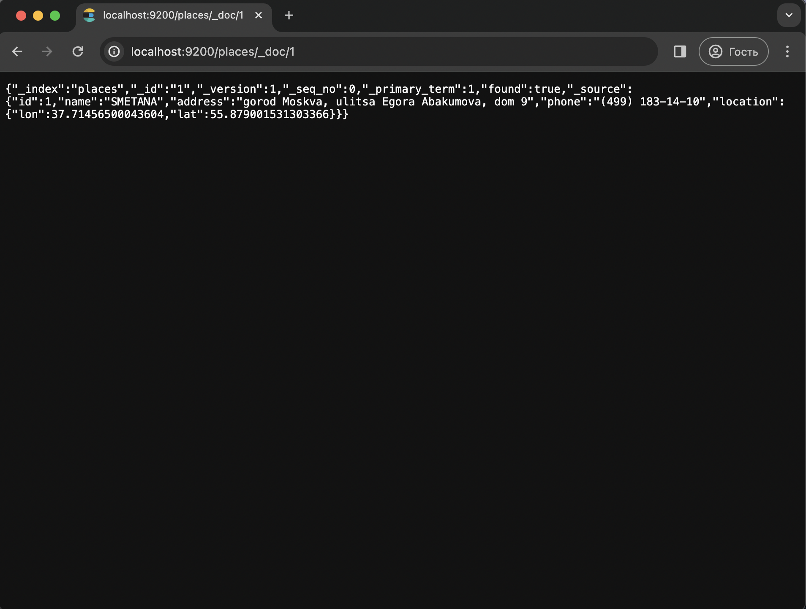
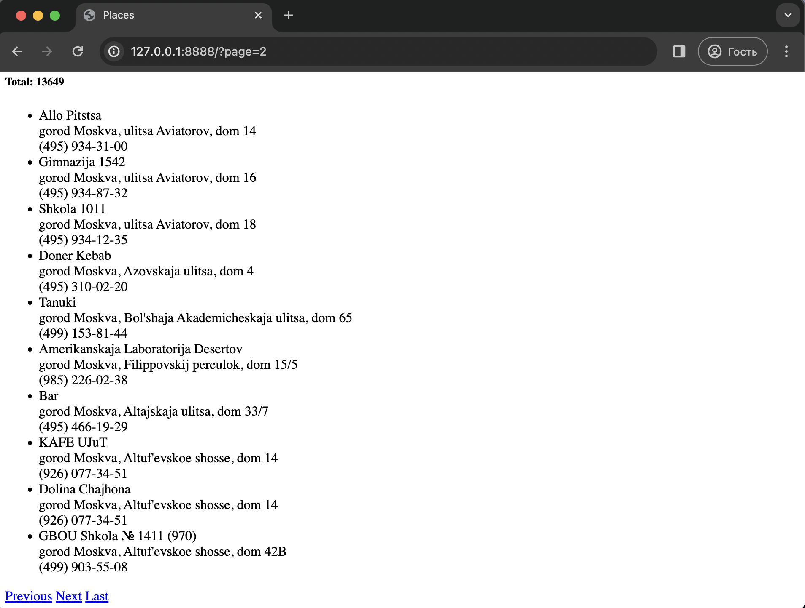
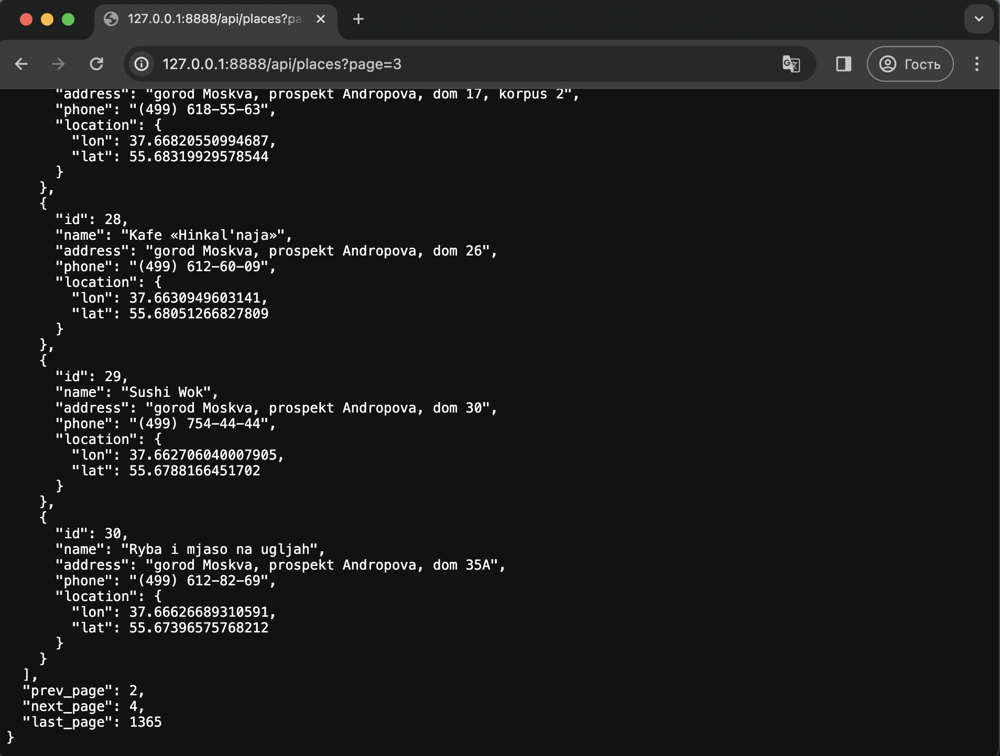
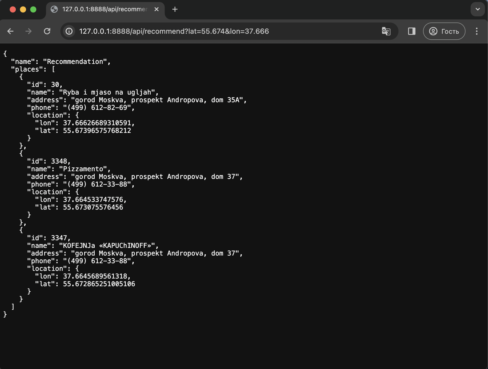
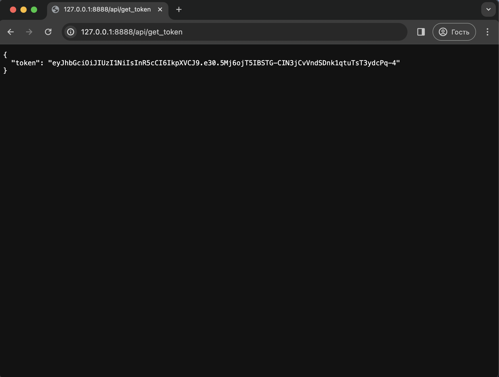
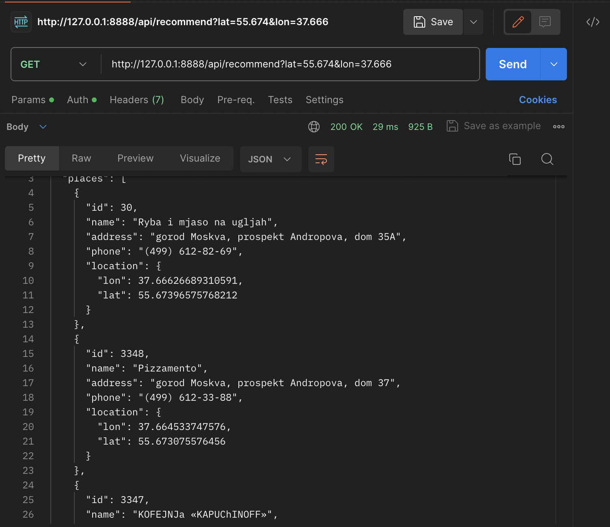

# Restaurant Search Application
This Go-based application provides a simple interface and API for searching and 
interacting with a dataset of restaurants in Moscow, Russia. The application is
designed to work with Elasticsearch as the underlying database, utilizing the Go 
Elasticsearch bindings.

### Setup
To set up the application:
```
make run_ex00 
```

1. Run the provided docker-compose.yml file to start Elasticsearch service.
2. Initialize Database and Upload Dataset: The Makefile automatically performs the necessary 
steps to initialize the Elasticsearch index, create mappings, and upload the provided 
dataset of restaurants.  
`${BUILD}/inserter`  
This command runs the inserter program to upload the dataset into Elasticsearch.

### Loading Data
The dataset contains information about restaurants, including ID, Name, Address, 
Phone, Longitude, and Latitude. 

`curl -s -XGET "http://localhost:9200/places/_doc/1"`



### Simplest Interface
The application provides a simple HTML UI for the database, rendering a page with 
a list of restaurant names, addresses, and phones. Pagination is implemented, 
allowing users to navigate through the list. The HTTP application runs on port 8888, 
and the UI is accessible via the browser.

`http://127.0.0.1:8888/?page=2`



### Proper API
The application implements an API that responds with Content-Type: application/json, 
providing a JSON version of the restaurant list. The API supports pagination, and in 
case of an invalid 'page' parameter, it's corresponding JSON error message.

`http://127.0.0.1:8888/api/places?page=3`



### Closest Restaurants
The main functionality is searching for the three closest restaurants based on the 
user's coordinates. The API endpoint /api/recommend takes latitude and longitude 
parameters and returns JSON with the three closest restaurants.

`http://127.0.0.1:8888/api/recommend?lat=55.674&lon=37.666`



### JWT Authentication
Authentication is implemented using JWT. The /api/get_token endpoint generates a token, 
and the /api/recommend endpoint is protected with a JWT middleware. Access to the API 
requires a valid JWT token provided in the Authorization: Bearer <token> header.

`http://127.0.0.1:8888/api/get_token`





