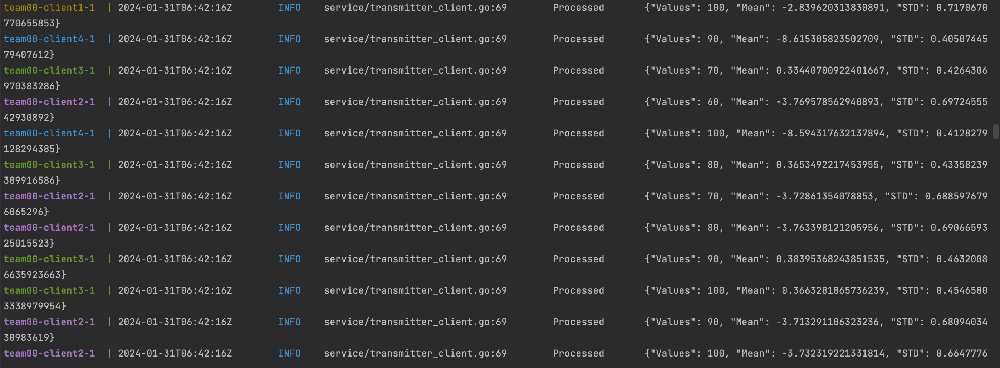
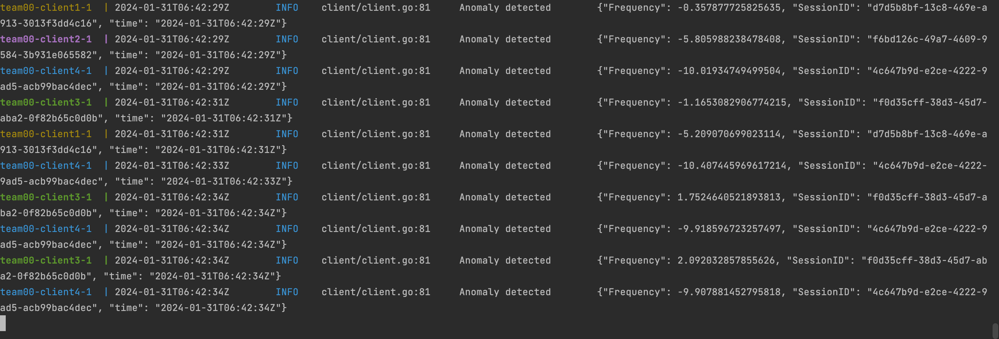
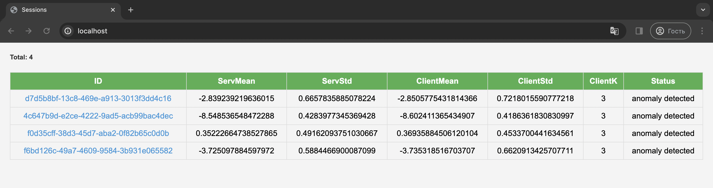
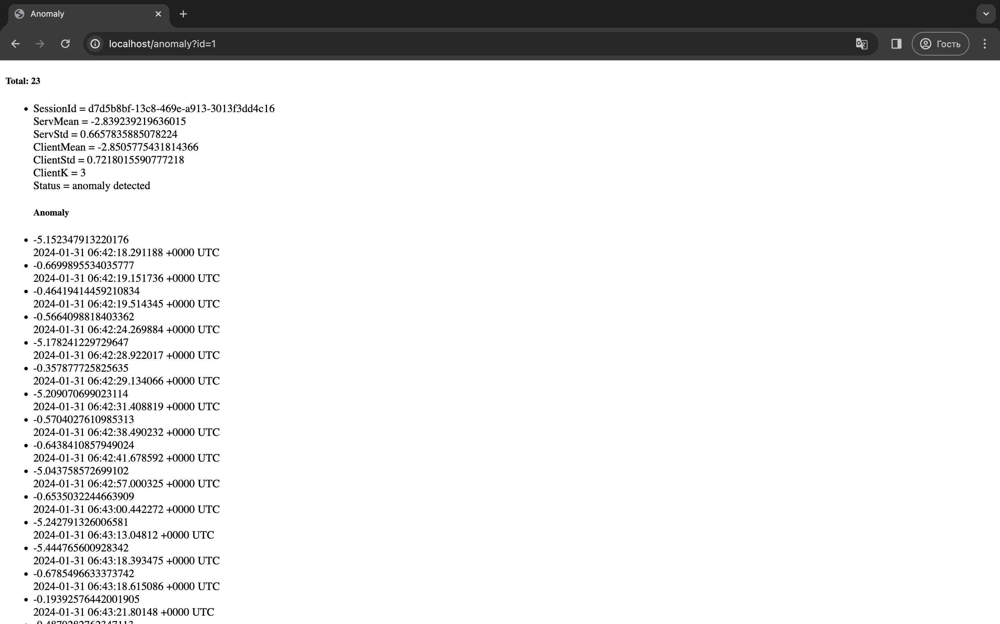

# Anomaly Detection System Overview
This project involves the implementation of a gRPC server, a client for anomaly detection, and 
integration with PostgreSQL using GORM. The system is designed to analyze random frequency data.

### Setup
To set up the application:
```
make compose-up
```

### Features
The transmitter implements the gRPC protocol, generating random values for 'session_id,' 'frequency,' 
and a UTC timestamp on client connections. The client receives a stream of entries with 'frequency' 
sampled from a normal distribution.



The anomaly detection mechanism on the client side processes the frequency stream, approximating mean
and standard deviation over time. When stable, it switches to anomaly detection using a specified STD
anomaly coefficient ('-k' parameter). Anomalies are logged based on deviations from the expected value.



Detected anomalies are stored in a PostgreSQL database using an ORM.

The service, accessible at http://localhost:80, also provides a user-friendly interface for exploring 
and analyzing anomalies detected in the frequency data.




